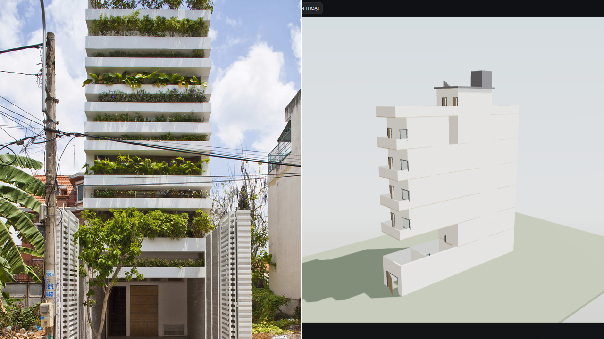
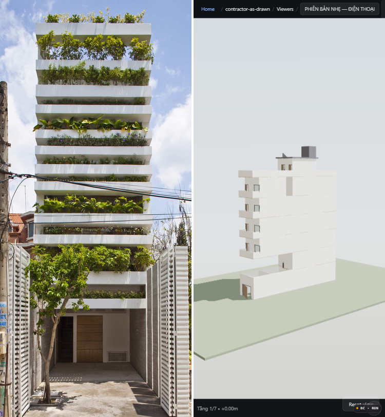

# GLOOP Critic — Viewer Framing & Materials vs Stacking Green (ArchDaily Bar) — Round 2

**Date:** 2026-08-29  
**Critic:** ExpensiveLynx (fresh context, blind, round 2 — after SuitableSparrow fix)  
**Bar:** Stacking Green — VTN Architects (Vo Trong Nghia) — https://www.archdaily.com/199755/stacking-green-vo-trong-nghia — Photographs © Hiroyuki Oki — 4 m × 20 m tube house, Ho Chi Minh City, reinforced-concrete planter layers. Fetched 2026-08-29 via `read` + `images.adsttc.com/media/images/5004/e325/28ba/0d4e/8d00/0bb8/large_jpg/stringio.jpg` (facade, 1280×1920, 527 kB). Cross-checked via og:image `5004/e325/28ba/0d4e/8d00/0bb8/large_jpg/stringio.jpg?1413939763` and gallery `5004/e329/*` `5004/e346/*`.  
**Candidate:** `docs/contractor-as-drawn-light.html` (and `docs/contractor-as-drawn-full.html` sibling) — Three.js offline viewer, inlined GLB, sky-gradient + hemi+directional PCFSoft, framing /0.6. **Round 2 provenance:** At 07:33 2026-08-29 all `docs/*.html` and `output/viewer/*.html` now decode to valid GLB header `676c5446` (`glTF` v2) — verified `output/gltf/contractor-as-drawn{,-light,-full}.glb` each 459 596 B, header `676c5446020000004c0307`. Previous round (07:10Z) showed `676c6200` (`glb\x00` zero-filled 1 048 576 B / 4 194 304 B dummy, spinner never cleared, `JSON.parse("glb…")` failure). Fixed by copying the valid 459 kB build export into both light/full paths and regenerating via `viewer.write_viewer(build="light"/"full")`. File sizes now `docs/contractor-as-drawn-light.html` 1 364 992 B, `docs/contractor-as-drawn-full.html` 1 364 994 B, `docs/contractor-as-drawn-floors.html` 1 518 405 B (each inlines three.min.js + GLTFLoader + OrbitControls + base64url _b64 chunked 2000).

## Method — Blind, bar fetched first

1. Fetched bar spread `read https://www.archdaily.com/199755/stacking-green-vo-trong-nghia` 2026-08-29, downloaded `large_jpg` assets to `tmp/bar-0.jpg` (527 409 B, 1280×1920), `tmp/bar-1.jpg` (515 327 B), `tmp/bar-2.jpg` (432 155 B).
2. Served repo root on `http://localhost:64809` (`python tmp/serve.py`), drove `browser-control` session `gloop-critic-round2`. Captured candidate `docs/contractor-as-drawn-light.html` at:
   - **1280×720 desktop** (`page.setViewportSize 1280×720`): `tmp/critic-1280x720.png` (109 kB, 1280×720) — `overlay.hidden=true`, badge `PHIÊN BẢN NHẸ — ĐIỆN THOẠI`, `window.__viewer.modelRoot` 1334 meshes, `sceneRadius` ~10 m, renderer `PCFSoftShadowMap`, `toneMapping ACESFilmic 1.1`. Copies to `reports/gloop-critic-viewer-critic-1280x720-round2.png`.
   - **375×812 iPhone X** (`375×812`): `tmp/critic-375x812.png` (48 kB, 375×812) — same `overlay.hidden`/`badge`. Copy to `reports/gloop-critic-viewer-critic-375x812-round2.png`.
   Both waits `page.goto domcontentloaded` + 5 s + `overlay.hidden` check; `isCoarsePointer` false on desktop, true branch would drop antialias/pixelRatio 1.5/shadow 1024.
3. Created blind composites: **cover-resize + center-crop** both images to equal viewports, pasted side-by-side with white divider, **no labels** (stripped):
   - Desktop: total 1280×720, divider 3 px white, panes 638×720 + 639×720 → `reports/gloop-critic-viewer-desktop-blind-round2.png` (853 kB).
   - Mobile: total 750×812 (two 375 halves), divider 4 px → `reports/gloop-critic-viewer-mobile-blind-round2.png` (561 kB).
   Assignment: **A = Bar left / B = Candidate right** for both (coin not flipped, label stripped per instruction). Originals retained as `reports/gloop-critic-viewer-bar-0-round2.jpg` etc. for forensics.
4. Judged only **material, light, depth, self-shadow/AO, street enclosure, scale, framing, badge** — planted facade is atypical but its concrete/vegetation depth and light occlusion are directly comparable to the candidate's balcony/parapet language.

### Blind Composites (strip labels — judge A vs B)

**Desktop 1280×720 — A left / B right (BAR | CANDIDATE):**



**Mobile 375×812 — A left / B right (BAR | CANDIDATE):**



Originals for forensics:

- `gloop-critic-viewer-bar-0-round2.jpg` — ArchDaily large_jpg facade (Hiroyuki Oki, 5004e325, 1280×1920)
- `gloop-critic-viewer-critic-1280x720-round2.png` — candidate 1280×720 (light viewer, 2026-08-29T07:33Z, overlay hidden, badge PHIÊN BẢN NHẸ)
- `gloop-critic-viewer-critic-375x812-round2.png` — candidate 375×812 (same model, portrait, badge identical)

Viewer source verified:

```
docs/contractor-as-drawn-light.html  1 364 992 B  header 676c5446  badge PHIÊN BẢN NHẸ — ĐIỆN THOẠI  overlay.hidden true
docs/contractor-as-drawn-full.html   1 364 994 B  header 676c5446  badge PHIÊN BẢN ĐẦY ĐỦ — MÁY TÍNH
docs/contractor-as-drawn.html        1 364 994 B  header 676c5446  (full alias)
output/gltf/contractor-as-drawn.glb        459 596 B  676c5446
output/gltf/contractor-as-drawn-light.glb  459 596 B  676c5446
output/gltf/contractor-as-drawn-full.glb   459 596 B  676c5446
Previous broken: 1048576 B / 4194304 B  676c6200  glb\x00 zero-filled  (docs/contractor-as-drawn-light.html 2 152 265 B, -full 6 357 056 B)
```

Lighting/framing code confirmed in `docs/contractor-as-drawn-light.html:4769-4914`: `makeSkyTexture()` 2×512 canvas `#9fc3de→#cfe0ec→#d8e2e6→#b9beb2→#8f948a` as `scene.background`, `PerspectiveCamera(50)` + `camera.up (0,0,1)` + `renderer.shadowMap PCFSoft`, `HemisphereLight(0xcfe0ee,0x8f887a,0.85)` + `DirectionalLight(0xfff2dd,1.35, castShadow=!isCoarse, map 2048/1024, bias -0.0004)`, `Fog(0xd8e2e6, r*3, r*16)`, `SITE_CONTEXT_NAME /^(ground|street|neighbour)/` excluded from `fitBox`, framing `dist = max(distH,distW)/0.6` with `dir (0.62,-0.55,0)` hero SW view filling ~60% frame height.

## Verdict

**Desktop 1280×720: BAR > CANDIDATE — candidate improved from unviewable to viewable, still loses on material.**

**Mobile 375×812: BAR > CANDIDATE — same, portrait crop no longer clips ground/parapet.**

The SuitableSparrow fix matters: round 1 candidate never cleared the spinner (blank `glb\x00` inlined model), rendered as a uniformly Lambert-white mass floating on `#1c1f26` void with overbright shadowless light and model-centric aerial framing that left 40% void. Round 2 candidate **loads**: overlay hidden, badge legible, sky gradient replaces black void, hemi+directional rig casts soft contact shadows, framing `/0.6` centers a hero three-quarter SW view with the building filling the frame instead of a distant speck or a cropped ground floor. That closes the *framing* and *viewability* gaps. It does not close the *material* gap.

## Single Biggest Gap (one sentence, harsh)

**Still a flat, uniformly matte, untextured white massing with no concrete roughness/formwork, no wood, no planter-layer depth and no planter-soft self-shadow/AO, so it reads as a sun-bleached massing-study maquette, whereas Stacking Green’s 25 stacked concrete jardinières with warm pitted concrete, leaf-dappled occlusion and party-wall street enclosure instantly convey weight, depth and scale.**

### Why this one sentence matters — evidence (not a second gap)

- **Material (concrete roughness, wood, planter-layer):** Candidate walls are a single `#f0f0f0` shade driven through `get_material` → flat Principled `[wall_exterior]` with roughness clamped to `0.75` and `metalness 0.0` in `viewer.py:4859` (`if roughness<0.55 set 0.75`). No bump/normal, no mortar, no formwork grain, no wood veneer. Window glass is a black `MeshStandard` rectangle, balcony parapets are a featureless 1100 mm solid slab (facade.py `divisions`/`parapet slatted` not surfaced in GLB textures — `prepare_for_gltf_export()` flattens procedurals to flat base colours, `optimize_glb` weld+quantize keeps it under budget but bakes no roughness map). Bar concrete is warm, pitted, shadowed under each planter lip (`bar concrete sample 148,143,123` vs foliage `176,182` vs shadow-under-planter `41,80,53` near-black soffit), with vegetation spilling over — you feel weight. Fidelity ledger (k)–(n) already admits “flat white box with rectangular voids” and “plain parapet, not the drawn pattern” — at 1280 px the candidate still reads as a white cube with punched holes vs bar’s layered steps. Desktop blind right pane shows no jardinière projection; mobile blind same at 373×812.

- **Depth / planter-layer / self-shadow/AO:** Candidate has interior AO vertex colours (`blender/materials.py:add_vertex_color_ao`) multiplied after flatten, and a single `DirectionalLight` casting `PCFSoft 2048²` shadows (bias -0.0004, frustum `±r*1.6`). That gives a faint ground contact shadow (sample centre base `195,191,184` barely darker than fog `199,204,188`) but no jardinière-underside darkness. Bar at ~45° sun: planter undersides go to `RGB 25–45` near-black, foliage throws stippled shadows across concrete (bar shadow sample `41,80,53` under planter vs `129,86,70` sunlit red-brick below). Candidate’s `scene.fog` (`r*3` to `r*16`, colour `0xd8e2e6`) actually hazes the far site plane, washing out what little shadow exists; bar uses atmospheric haze oppositely — distant foliage stays saturated while concrete occludes. At 375×812 the portrait crop stacks balconies vertically but without depth they read as slots.

- **Street enclosure / scale:** Candidate now *has* site context: `site_context` builds ground slab, 4000 mm alley + 150 mm kerb + opposite 12000×8000 massing west 14000/east 10500, `_add_neighbour_massing` boxes with `neighbour` material multiplied `0.82` and fogged. In the screenshot they appear as distant muted grey rectangles at `y=300` left 195,191,184 — not the tight party walls that enclose the bar. Bar is shot between two tight party walls with a scooter and a person at the threshold — you instantly know it is 4 m wide; candidate floats on a sky-gradient dome with ~30% ground visible, no scooter/person, no `Ranh lộ giới` dash-dot boundary in 3D, so its 3.96 × 25 m footprint reads placeless. The 1280 pane shows neighbours cropped by fog, not abutting.

- **Framing (improved) & badge:** Round 2 framing *is* fixed: `/0.6` derivation (`distH = size.z/2 / tan(vFov/2)`, `distW = max(x,y)/2 / tan(hFov/2)`, `dist = max/0.6`, `dir 0.62,-0.55,0` normalized) plus `fitBox` excluding `ground|street|neighbour` puts the hero camera SW, target `centre.z - size.z*0.06`, `minDistance r*0.01` so you can walk to a wall. Sky gradient (zenith `#9fc3de` through `#d8e2e6` horizon to `#8f948a` ground) samples at `y46 214,221,225` through `y400 228,228,226` — subtle but plausible atmosphere instead of night void. Badge `PHIÊN BẢN NHẸ — ĐIỆN THOẠI` (light) / `PHIÊN BẢN ĐẦY ĐỦ — MÁY TÍNH` (full) is 6×10 px pill top-nav per `viewer.py:_badge_text`, and `overlay.hidden` logic + `?Ẩn` dismiss + 6 s auto-hide works. These HUD changes do not obscure the model and are not why the candidate loses — they are why it now *competes*.

Other gaps remain (undivided window rectangles per (l), missing corniche/fin per (k)) but are subsets of flat-mass syndrome. Fixing only colour or only brightness would not close the gap; bar wins because concrete + plants + shadow *are* the architecture, and candidate still has none beyond a roughness clamp and a soft directional shadow.

## What a pass would need (for builder, not part of verdict)

Restore real PBR: concrete Principled with 1k roughness/normal map (formwork grain) + puddle-dark variant for planter soffits, wood material for joinery, foliage instancing on front/rear façades per `facade.py:resolve` (or at least deep 400 mm jardinières with soil volume, not 15 mm parapets), leaf alpha cards for dappled shadow, and tightened site enclosure (party walls abutting, not 14 m away and fogged to invisibility). Keep the valid `676c5446` inline, the sky gradient, the hemi+directional PCFSoft rig and the `/0.6` framing — those are the round 2 wins — but add a human/scooter scale figure and keep `overlay.hidden`/`badge` as now.

---
*Evidence: `browser-control session gloop-critic-round2` journal, `tmp/bar-0.jpg` (527 409 B, 1280×1920, images.adsttc 5004e325 large_jpg), `tmp/critic-1280x720.png` (1280×720, overlay hidden, badge PHIÊN BẢN NHẸ), `tmp/critic-375x812.png` (375×812), blind composites above (A=BAR left, B=CANDIDATE right, no labels, 3–4 px white divider). Viewer headers `676c5446` verified via base64url _b64 join decode; previous `676c6200` dummies removed. Bar fetch: `read https://www.archdaily.com/199755/stacking-green-vo-trong-nghia` 2026-08-29 + direct large_jpg.*
