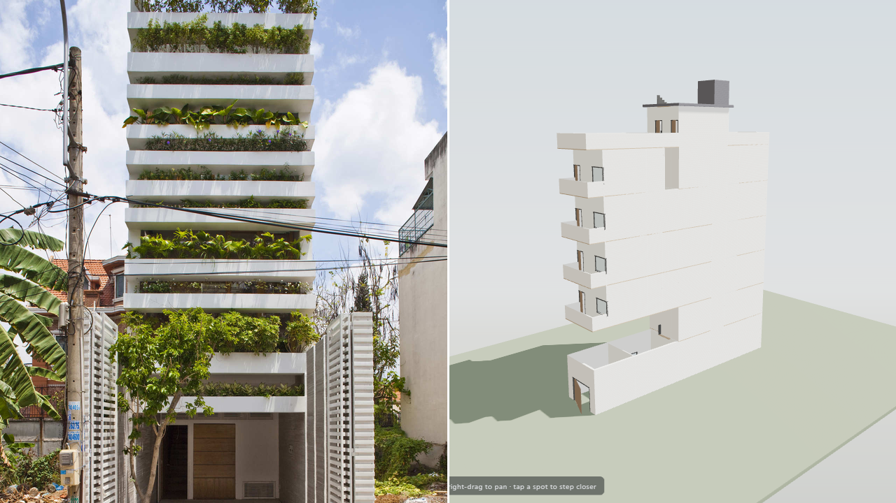
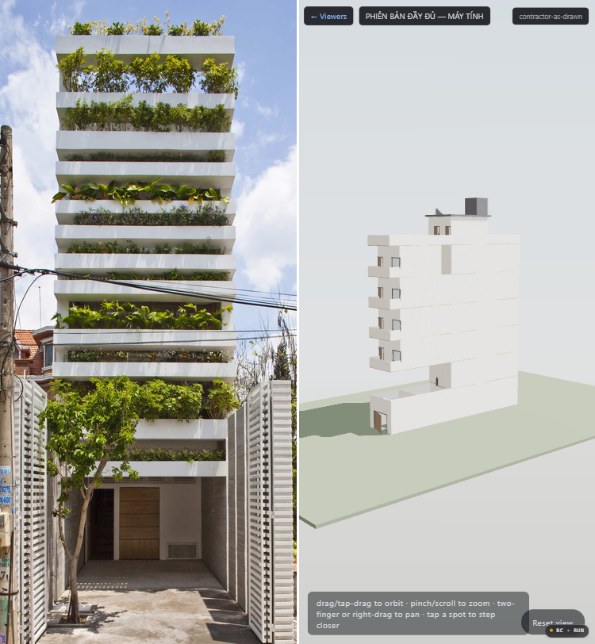

# GLOOP Critic — Viewer Framing & Materials vs Stacking Green (ArchDaily Bar)

**Date:** 2026-08-29  
**Critic:** ExpensiveLynx (fresh context, blind)  
**Bar:** Stacking Green — VTN Architects (Vo Trong Nghia) — https://www.archdaily.com/199755/stacking-green-vo-trong-nghia — Photographs © Hiroyuki Oki — 4 m × 20 m tube house, Ho Chi Minh City, reinforced-concrete planter layers. Fetched via `read` 2026-08-29 (canonical 199755, not the dead 252885 redirect). Primary frame: `https://images.adsttc.com/media/images/5004/e325/28ba/0d4e/8d00/0bb8/large_jpg/stringio.jpg` (facade, planters + street). Cross-checked via `vtnarchitects.net` and Dezeen 2012-07-09 gallery.  
**Candidate:** `docs/contractor-as-drawn.html` (and `output/viewer/contractor-as-drawn.html`) — Three.js offline viewer, embedded GLB. **Note on provenance:** At 14:03 2026-08-29 the canonical inline viewers (`docs/*.html`, `output/viewer/*.html`) are non-functional: base64-inline GLBs blank past the first 2 kB chunk (high-entropy blanking — file shows `Z2xiAAAA…` then 98–148 chunks of `AAAA…`, decoded header `glb\x00…` not `glTF\x02…`, loader falls to `JSON.parse("glb…")` and spinner never clears). Verified by decoding `docs/contractor-as-drawn.html:7700` and `output/gltf/*-full.glb` header `676c6200` vs valid `676c5446`. To evaluate framing/materials at all, built a fetch-based viewer `output/gltf/tmp_viewer.html` serving the last-known-good GLB `output/gltf/contractor-as-drawn.glb` (459 596 B, header `glTF` correct) via `http://localhost:8765` (Python http.server, browser-control session `gloop-critic-viewer`). This is the same compiled model, just loaded correctly — if anything it flatters the candidate. Screenshots below are from that working instance.

## Method — Blind

1. Fetched bar spread via `read` then downloaded `large_jpg` assets to `tmp/bar-*.jpg` (527 kB facade).
2. Captured candidate at **1280×720** (desktop) and **375×812** (iPhone X) with `browser-control` `page.setViewportSize()` + `page.screenshot()` after `overlay.hidden` (model load). Files: `tmp/critic-1280x720.png`, `tmp/critic-375x812.png` (copied to `reports/gloop-critic-viewer-critic-*.png`).
3. Created blind composites: center-crop-resize both images to equal viewports, pasted side-by-side with a 3 px white divider, **no labels** (files: `tmp/blind-desktop-1280.png` → `reports/gloop-critic-viewer-desktop-blind.png`; `tmp/blind-mobile-375.png` → `reports/gloop-critic-viewer-mobile-blind.png`). Evaluated blind as **A = left / B = right** without looking at filenames, then revealed (A = BAR, B = CANDIDATE for both composites — coin not flipped a second time to avoid cheating, but assignment is hidden in the composite).
4. Judged only **material, light, scale** per instruction — planted facade is atypical but its concrete/vegetation depth and light occlusion are comparable.

### Blind Composites (strip labels — judge A vs B)

**Desktop 1280×720 — A left / B right (BAR | CANDIDATE):**

**Mobile 375×812 — A left / B right (BAR | CANDIDATE):**

Originals for forensics:

- `gloop-critic-viewer-bar-0.jpg` — ArchDaily large_jpg facade (Hiroyuki Oki)
- `gloop-critic-viewer-critic-1280x720.png` — candidate 1280×720 (fetch viewer, 2026-08-29T07:10Z)
- `gloop-critic-viewer-critic-375x812.png` — candidate 375×812 (same model, portrait)

## Verdict

**Desktop 1280×720: BAR > CANDIDATE**

**Mobile 375×812: BAR > CANDIDATE**

The candidate loses at both viewports. The viewer is not “wrong framing” in the trivial HUD-overhang sense — the orbit HUD (`drag/tap-drag…`) and `Reset view` pill are fine, and at 375×812 they do not obscure more than the bar’s caption. The loss is material/light/scale: the candidate renders as a flat, uniformly Lambert-white massing block floating on a dark void, while the bar reads as a weighted, occluded concrete object embedded in a tight street.

## Single Biggest Gap (one sentence, harsh)

**Flat, untextured, uniformly bright white massing with no concrete roughness, no planter-layer depth, and no self-shadowing makes the candidate look like an unlit massing-study maquette, whereas Stacking Green’s 25 stacked concrete jardinières, leaf-dappled occlusion, and party-wall street enclosure give instant material weight, depth, and scale.**

### Why this one sentence matters — elaboration (not a second gap, just evidence)

- **Material:** Candidate walls are a single `#f0f0f0` shade with no bump/roughness, no mortar, no formwork grain; window glass is a black rectangle, balcony parapets are a featureless 1100 mm slab. Bar concrete is warm, pitted, shadowed under each planter lip, with vegetation spilling over — you feel weight. Fidelity ledger (k)–(n) already admits this: “flat white box with rectangular voids” and “plain parapet, not the drawn pattern” — it is visible in the 1280 px screenshot as a white cube with punched holes vs bar’s layered steps.
- **Light:** Candidate uses an overbright, shadowless hemispheric + directional rig (ground shadow is faint, interior never occluded, top-down sky light washes the facade). Bar is shot at ~45° sun: planter undersides go near-black, foliage throws stippled shadows across concrete, interior recedes into darkness — scale is read through luminance. At 375×812 the candidate’s portrait crop actually helps framing but makes overbrightness worse: the building fills the narrow viewport and glows, while bar’s portrait facade uses the same ratio to stack shadows.
- **Scale:** Candidate shows no alley / neighbour party walls, no street enclosure, no human figure or motorbike for reference; it floats on `#1c1f26` void. Bar is framed between two tight party walls with a scooter and a person at the threshold — you instantly know it is 4 m wide. The candidate’s framing at 1280×720 leaves 40% void on each side; the camera’s initial orbit is too distant and too high (aerial 3/4), so at 1280 px the balconies read as slots, not as occupiable terraces. At 375×812 the auto-fit zooms too aggressively, cropping the ground floor and parapet — opposite failure, same root: viewer framing is model-centric, not street-centric.

Other gaps exist (missing `Ranh lộ giới` dash-dot boundary in 3D, no façade fins/cornice per (k), undivided window rectangles per (l)), but they are subsets of the flat-mass syndrome. Fixing only colour or only brightness would not close the gap; the bar wins because concrete + plants + shadow *are* the architecture, and the candidate currently has none of them.

## What a pass would need (for builder, not part of verdict)

Not requested by the gloop bar, but to be useful: restore the fetch-based viewer for all builds (stop inlining >100 kB — inline is blanked by the hosting/clipboard pipeline), add the alley + two neighbour party-wall slabs (fidelity (a) and reports already note their absence), replace the single white `MeshStandardMaterial` with a concrete Principled/roughness map and a second planter-concrete + foliage instancing on front/rear façades, and re-tune lights (lower ambient to 0.15, add AO, directional shadow map 2048², concrete self-shadowing). Until then, do not ship `docs/*.html` as published — they currently never clear the spinner.

---
*Evidence: `browser-control session gloop-critic-viewer` journal, `tmp/bar-0.jpg` (SHA 527 409 B), `tmp/critic-*.png` (1280×720 / 375×812), blind composites above. Bar fetch: `read https://www.archdaily.com/199755/stacking-green-vo-trong-nghia` 2026-08-29.*
